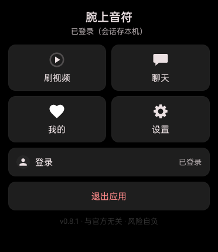
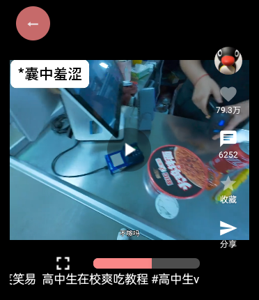
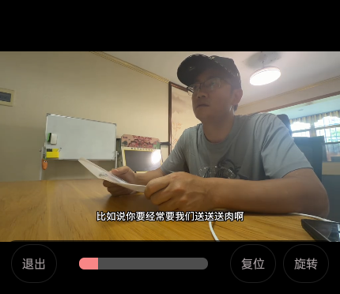
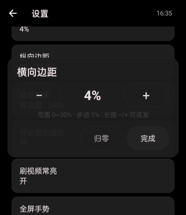

<div align="center">

# 腕上音符

**安卓手表上的轻量抖音客户端** —— 刷视频、回私信，抬腕即达。

[](https://github.com/5h1iky/wanshang-yinfu/releases)
[](https://github.com/5h1iky/wanshang-yinfu/actions/workflows/build.yml)
[](LICENSE)
[](#安装)
[](https://github.com/5h1iky/wanshang-yinfu/stargazers)

*纯手动操作 · 免费无广告 · 登录态只存本机*

</div>

---

## 界面

> 手表实机截图（OPPO Watch 3，372×430）；会话昵称已打码。

| 主屏 | 刷视频 | 全屏播放 |
|:---:|:---:|:---:|
|  |  |  |

| 私信会话 | 聊天与快捷回复 | 设置与边距调节 |
|:---:|:---:|:---:|
|  |  |  |

---

## 这是什么 / 不是什么

| 是 | 不是 |
|---|---|
| 一个跑在**安卓手表**上的第三方抖音网页版客户端 | 官方应用，或与抖音官方有任何合作 |
| 给**自己和朋友**用的兴趣项目 | 商业产品；无广告、无收费、无统计 SDK |
| 学习目的的开源代码（GPL-3.0） | 破解工具或自动化脚本（无任何自动化骚扰能力） |

**风险自负**：使用本应用产生的一切后果（账号限制等）由使用者自行承担，详见应用内首启的免责声明。

### 已知局限与失效风险（请先读完再决定要不要用）

| 项 | 说明 |
|---|---|
| **开发方式** | 本项目由**非专业开发者借助 AI 辅助**完成。功能可用、持续维护，但**不等于**专业团队的工程保障 |
| **依赖非公开接口** | 应用依赖抖音的网页/接口行为。**抖音一改版，相关功能可能直接失效** |
| **不保证及时修复** | 接口或页面结构变更后，**不承诺**在多久内修好——快的当天，慢的可能要等社区逆向出新方案 |
| **谁会先挂** | ① 私信/评论（依赖网页 DOM 结构，最脆）→ ② 视频流（依赖签名算法 a_bogus，抖音大改时要等新算法）→ ③ 点赞/收藏 |
| **失效时的表现** | 通常是"接口全部报错 / 列表空白"，而不是崩溃。App 内 **设置 → 诊断日志** 能看到线索 |
| **不提供任何承诺** | 无技术支持、无可用性保证，随时可能停止更新 |

> 换句话说：**这是一个"能用就用"的朋友间项目，不是产品。** 介意的请用官方客户端。

## 功能

| 模块 | 说明 |
|---|---|
| 刷视频 | 上下滑切换 · 预加载缓冲 · H.264 / 540p 省流选档（AMOLED 省电）· 登录态个性化推荐 |
| 播放控制 | 单击呼出面板（暂停键 + 进度条）· 双击左右半屏 ±10s · 拖动进度条跳转 |
| 全屏播放 | 进度条左侧一键全屏（画质不变大，但能腾出手势位并转横屏：横屏视频占屏高 48.6% → 65%）· 全屏内双指缩放 1x~5x · 放大后单指拖动画面 · 「复位」键或双击复位 · 手动旋转（横竖屏切换） |
| 私信 | 会话列表 → 选人 → 聊天 · 文字收发 · 快捷回复（4 个槽位可自编，聊天与评论共用；留空即隐藏该按钮；默认关闭可在设置里打开） |
| 互动 | 点赞 / 收藏 / 评论（看 + 发）/ 分享=复制作品链接 |
| 我的 | 喜欢历史（服务端拉取）· 看过记录（本地账本）· 作者主页 |
| 手表适配 | 圆屏边距百分比可调（点开面板用 − / + 步进 1%，0~30%，调的时候页面实时内缩）· 界面缩放与字体大小独立调节 · 表冠滚动（可选开关）· **无手势无按键设备完整可用**（全页面可见返回键）· 刷视频常亮开关 |
| 更新 | GitHub Releases 静默检测，不打扰 |

**架构一句话**：读取类请求（视频流 / 评论列表 / 喜欢 / 主页）走**原生 API 直连**（App 内 Rhino 跑 a_bogus 签名，零后端、快首屏、省电）；写入类操作（点赞 / 评论 / 私信 / 登录）走 **App 内单例 WebView 引擎**（官方页面 SDK 承担全部签名与风控票据，零复刻成本）。这是本项目在"协议复刻风险"与"手表性能基线"之间取得的平衡，详见下方[技术](#参考与致谢)一节。

## 安装

1. 到 [**Releases**](https://github.com/5h1iky/wanshang-yinfu/releases) 下载 `wanshang-yinfu-vX.Y.Z-release.apk`
2. 传到手机/手表上，用文件管理器侧载安装（Android 5.0+；MIUI 等系统需允许"安装未知应用"）
3. 首启阅读并同意免责声明 → 登录（扫码）→ 开刷

> 表上没有浏览器？应用内的链接点击在无浏览器设备上会静默提示，不影响其它功能。

## 自己编译

**环境要求**：JDK 17 或更高（本项目用 21）+ Android SDK 36。

```bash
git clone https://github.com/5h1iky/wanshang-yinfu.git
cd wanshang-yinfu
./gradlew assembleDebug          # 出 debug 包
./gradlew assembleRelease        # 出 release 包（需自配 keystore.properties，见下）
./gradlew testDebugUnitTest      # 全部单元测试
```

> **不需要改任何配置文件就能编译**。如果你的默认 JDK 不是 17+，请在**自己的用户级**配置里
> 指定（不要改仓库里的 `gradle.properties`）：
>
> ```properties
> # Windows: %GRADLE_USER_HOME%\gradle.properties
> # macOS / Linux: ~/.gradle/gradle.properties
> org.gradle.java.home=/path/to/your/jdk-21
> ```

`keystore.properties`（不入库，缺失时 release 自动退化为未签名）：

```properties
storeFile=keystore/你的签名.jks
storePassword=...
keyAlias=...
keyPassword=...
```

## 参考与致谢

本项目站在这些开源项目的肩膀上，按许可要求使用并致谢：

### 整体思路

| 项目 | 用在哪 | 许可 |
|---|---|---|
| [BiliClient 哔哩终端](https://github.com/huanli233/BiliClient) | **手表适配的参照系**：单行页头（返回箭头兼热区）、圆屏边距百分比方案、表冠滚动（RotaryScrollView 移植自它）、配色逻辑（Bili 色板）、以及"读接口直连 + 官方 Web 会话"的可行性先例 | GPL-3.0 |
| [DKVideoPlayer](https://github.com/Doikki/DKVideoPlayer) | **播放内核整库使用**：`dkplayer-java` / `dkplayer-ui` / `dkplayer-videocache` 三模块源码内嵌（`lib/` 目录），其 TikTok2 demo 是刷视频页（上下滑 + 预加载 + 单播放器复用）的原始蓝本 | Apache-2.0 |

### 签名与协议

| 项目 | 用在哪 | 许可 |
|---|---|---|
| [douyin_sign](https://github.com/ylcangel/douyin_sign) | a_bogus 签名的 JS 实现（`assets/sign/` 内嵌），App 内 Rhino 引擎执行，喂给所有原生直连接口 | Apache-2.0 |
| [DouYin_Spider](https://github.com/cv-cat/DouYin_Spider) | **只作知识参考**：扫码登录端点时序、bd-ticket-guard 头族分析、`get_identity_security_token` 的调用时机（其注释里的"secsdk 必需"等描述与 2026 实测不符处，以我们的实测为准） | 无 LICENSE，未复制代码 |
| [douyin-web-api-sdk](https://github.com/Rockedw/douyin-web-api-sdk) | **只作知识参考**：私信 Protobuf 结构的字段编号对照（会话创建 / 发消息信封） | 无 LICENSE，未复制代码 |

### 基础组件

| 组件 | 用途 |
|---|---|
| [Rhino](https://github.com/mozilla/rhino)（MPL 2.0） | App 内 JS 引擎，执行签名脚本 |
| [OkHttp](https://github.com/square/okhttp) / [Gson](https://github.com/google/gson)（Apache-2.0） | 网络与 JSON |
| [Glide](https://github.com/bumptech/glide)（BSD，部分 Apache-2.0） | 封面/头像加载 |
| AndroidX / Material Components（Apache-2.0） | UI 基础 |

> 许可合规：本项目 GPL-3.0，可合法吸收 GPL / Apache-2.0 / MIT 组件；无 LICENSE 项目只参考思路、不复制代码（上表已逐一标注）。若你是上述项目作者且认为引用方式不妥，请提 issue，我会立即处理。

## 隐私承诺

- 扫码登录产生的会话 **只存在设备本机**（SharedPreferences / WebView CookieStore）
- **不收集、不上传、不打点**：无账号信息、无聊天内容、无设备指纹、无崩溃上报
- 应用只有一个网络出口：抖音的接口本身
- 想验证？代码全开源，`LoginManager` / `DouyinApi` / `ChatEngine` 三处网络出口逐行可审

## 协议

[GPL-3.0](LICENSE)。使用到的第三方组件及其协议在源码头部与 `lib/LICENSE-DKVideoPlayer.txt` 中保留署名。

## 联系

GitHub [@5h1iky](https://github.com/5h1iky) · [作者主页](https://5h1iky.github.io/portfolio/)
